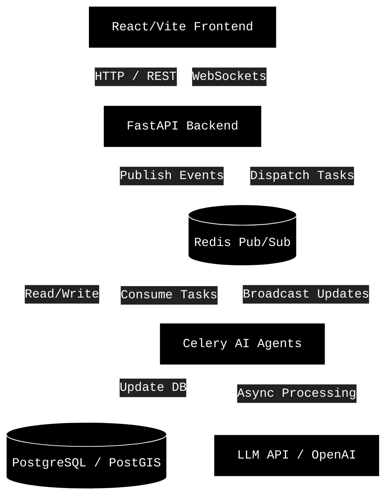
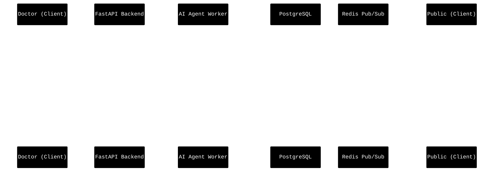
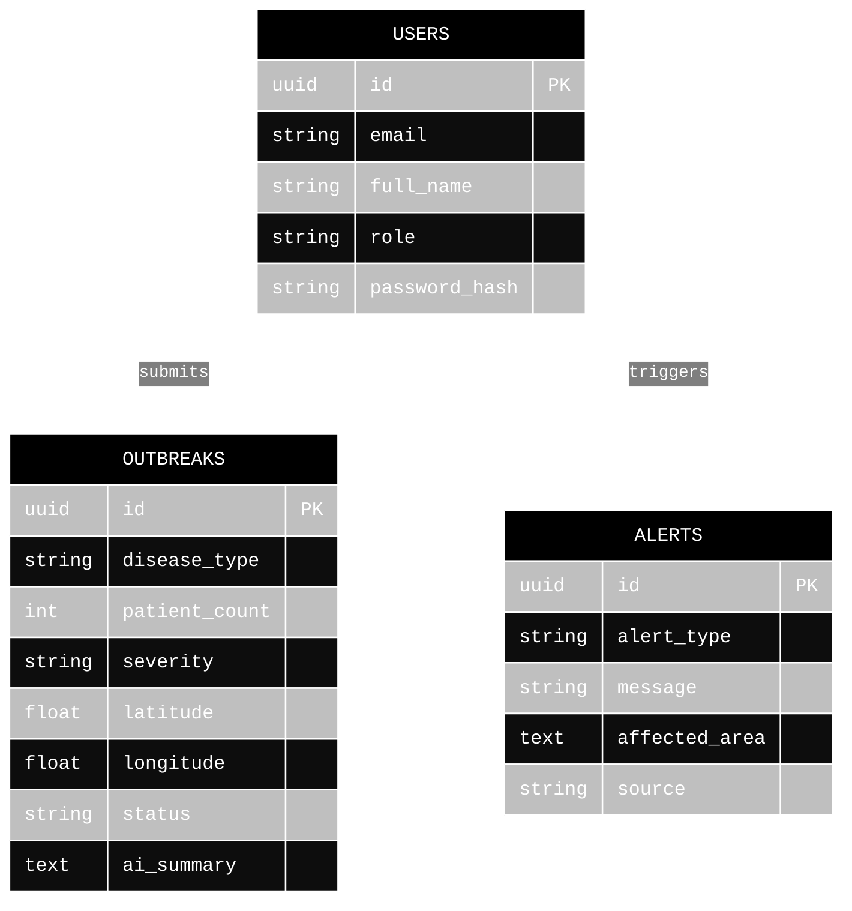

# SymptoMap

Real-time disease surveillance platform for outbreak reporting, approval workflows, public risk visibility, analytics, and health broadcast operations.

## Architecture and System Flow

### System Architecture



### Data Flow Diagram (DFD)



### Entity Relationship Diagram (Database Schema)



## What This Repository Contains

This repository is a monorepo with two active applications:

*   **backend-python/**: FastAPI + SQLAlchemy async backend (/api/v1 APIs, auth, doctor/admin flows, analytics, websocket updates, celery agents).
*   **frontend/**: React + TypeScript + Vite web app (doctor/admin/patient/public UI).

There are additional legacy files at the repository root (src/, root package.json) kept for history/compatibility. For normal development, use `frontend/` and `backend-python/`.

## Core Features

*   Doctor outbreak and alert submission workflows
*   Admin approval/rejection pipeline for submitted outbreaks
*   Public and authenticated outbreak map views
*   JWT authentication with refresh flow and role-aware routes
*   OTP-assisted login flow for user accounts
*   Real-time updates via WebSocket (Redis Pub/Sub)
*   Autonomous AI Agents via Celery for summarization, triaging, and forecasting
*   Analytics, prediction, reporting, and broadcast modules

## Tech Stack

*   **Frontend**: React 18, TypeScript, Vite, Tailwind
*   **Backend**: FastAPI, SQLAlchemy 2, Pydantic Settings, Alembic
*   **Agentic Orchestration**: Celery, Redis, LangChain
*   **Data**: SQLite (default local), PostgreSQL (production-ready, PostGIS), Redis
*   **Maps and Charts**: MapLibre GL, Recharts

## Quick Start (Local Development)

### Prerequisites

*   Python 3.10+
*   Node.js 18+
*   npm 9+
*   PostgreSQL + PostGIS (Optional, SQLite is supported out of the box)
*   Redis (Required for WebSockets and Celery Agents)

### 1. Backend Setup

```bash
cd backend-python
python -m venv venv
```

**Windows:**
```cmd
venv\Scripts\activate
```

**macOS/Linux:**
```bash
source venv/bin/activate
```

**Install dependencies and run API:**
```bash
pip install -r requirements.txt
uvicorn app.main:app --host 0.0.0.0 --port 8000 --reload
```

### 2. Frontend Setup

In a second terminal:

```bash
cd frontend
npm install
npm run dev
```

Frontend runs on http://localhost:3000 by default (`frontend/vite.config.ts`).

### 3. Open the App

*   **Frontend**: http://localhost:3000
*   **API docs (Swagger)**: http://localhost:8000/docs
*   **API docs (ReDoc)**: http://localhost:8000/redoc
*   **Health check**: http://localhost:8000/health

### One-Command Startup Scripts

The repository root includes helper scripts:

*   **Windows**: `start.bat`
*   **macOS/Linux**: `start.sh`

They start both backend and frontend, create missing folders, and bootstrap dependencies.

## Environment Configuration

### Backend

Create `backend-python/.env` (or copy from `backend-python/.env.example`) with at least:

```env
ENVIRONMENT=development
DEBUG=True
API_V1_PREFIX=/api/v1
DATABASE_URL=sqlite+aiosqlite:///./symptomap.db
JWT_SECRET_KEY=replace-with-secure-secret
DOCTOR_PASSWORD=replace-doctor-password
CORS_ORIGINS=http://localhost:3000,http://localhost:5173
```

**Optional integrations**: REDIS_URL, OPENAI_API_KEY, RESEND_API_KEY, SENDGRID_API_KEY, TWILIO_*, SENTRY_DSN.

### Frontend

Create `frontend/.env`:

```env
VITE_API_URL=http://localhost:8000/api/v1
```

## Local Access and Seeded Accounts

On startup, backend table creation and seeding run automatically if local data is empty.

**Common seeded users (development defaults):**

*   **Admin**: admin@symptomap.com / admin123
*   **Doctor**: doctor@symptomap.com / (value of DOCTOR_PASSWORD)

Doctor shared station login endpoint also exists: `POST /api/v1/doctor/login`.

Change all default credentials before any shared/staging/production deployment.

## API Surface (Highlights)

Base prefix: `/api/v1`

*   **Auth**: `/auth/*`
*   **Doctor station**: `/doctor/*`
*   **Admin approvals**: `/admin/*`
*   **Public outbreaks**: `/public-outbreaks/*` and related public routes
*   **Intelligence**: Analytics, reports, predictions, alerts, broadcasts, monitoring

Browse full schema at http://localhost:8000/docs.

## Testing

**Backend:**
```bash
cd backend-python
pytest
```

**Frontend checks:**
```bash
cd frontend
npm run lint
npm run type-check
npm run build
```

## Docker

A root `docker-compose.yml` is included for backend + frontend + celery startup:

```bash
docker-compose up -d
docker-compose logs -f
docker-compose down
```

## Repository Structure

```text
.
|- backend-python/         FastAPI backend and Agent orchestration
|- frontend/               React/Vite frontend
|- docs/                   Project docs and BRD material
|- scripts/                Utility scripts (import/export/deploy/setup)
|- data/                   Data templates/files
|- docker-compose.yml      Local container orchestration
|- start.bat / start.sh    Local quick-start scripts
```

## Security Notes

*   Rotate secrets before deployment (JWT_SECRET_KEY, doctor/admin credentials, API keys).
*   Review and sanitize any .env templates before committing.
*   Keep CORS origins scoped to known frontend domains in non-local environments.

## Additional Documentation

*   [DEPLOYMENT.md](DEPLOYMENT.md)
*   [DEPLOYMENT_GUIDE.md](DEPLOYMENT_GUIDE.md)
*   [CONTRIBUTING.md](CONTRIBUTING.md)
*   [USER_MANUAL.md](USER_MANUAL.md)
*   [CHANGELOG.md](CHANGELOG.md)

## License

MIT. See LICENSE.
