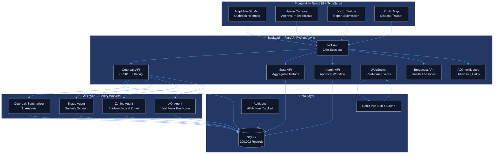
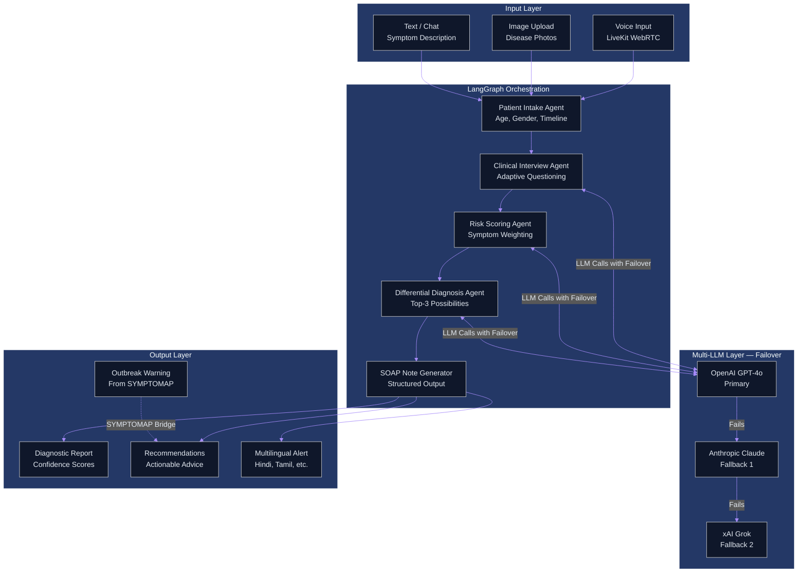
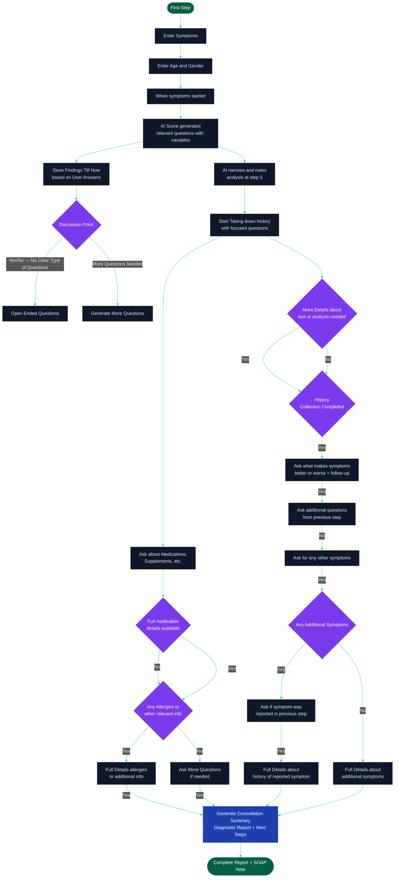

<div align="center">

<h1>🏥 The Healthcare AI Ecosystem</h1>
<h3>Two Integrated Solutions for Complete Health Protection</h3>

<p>
  <a href="https://symtomap-main.vercel.app/" target="_blank"></a>
  &nbsp;
  <a href="https://symptomap-2-python.vercel.app/" target="_blank"></a>
  &nbsp;
  <a href="https://healthzy.app/" target="_blank"></a>
  &nbsp;
  <a href="https://github.com/Rajkaran-122/Health_agent" target="_blank"></a>
</p>

<p>
  
  
  
  
  
  
</p>

<p><em>Integrating individual health intelligence with population-level disease surveillance — the only platform of its kind.</em></p>

</div>

---

## 📋 Table of Contents

- [Overview](#-overview)
- [The Two Platforms](#-the-two-platforms)
- [Ecosystem Integration](#-how-the-ecosystem-works)
- [Architecture](#-architecture)
- [Key Features](#-key-features)
- [Technology Stack](#-technology-stack)
- [Live Demos & Links](#-live-demos--links)
- [Pilot Results](#-proven-results-pilot-programs)
- [Roadmap](#-roadmap)
- [Documentation Directory](#-documentation-directory)
- [Setup & Running](#-setup--running)
- [Security & Ethics](#-security--ethics)
- [License](#-license)
- [Contact](#-contact)

---

## 🌐 Overview

This ecosystem addresses two parallel crises in global healthcare:

| Problem | Scale |
|---|---|
| Underserved populations without healthcare access | **80%** of rural populations |
| Disease outbreaks reported manually with delays | **Hours to days** lag time |
| Language barriers blocking effective diagnosis | **Billions** affected globally |
| No centralized real-time disease surveillance | **Every country** lacks unified data |

**Our solution:** Two purpose-built platforms — **SYMPTOMAP** for population-level disease surveillance, and the **Health Agent** for individual AI-powered health consultation — sharing a real-time data bridge so that when a doctor reports an outbreak, affected individuals are warned instantly.

---

## 🏥 The Two Platforms

### SYMPTOMAP — Real-Time Disease Surveillance

> **Live App:** [symtomap-main.vercel.app](https://symtomap-main.vercel.app/) &nbsp;|&nbsp; **Backend:** [symptomap-2-python.vercel.app](https://symptomap-2-python.vercel.app/)

SYMPTOMAP is an interactive, map-based disease surveillance platform for healthcare professionals. Doctors can report outbreaks in under 30 seconds; administrators get a live dashboard of disease spread across India.

**Core Capabilities:**
- 🗺️ **Interactive MapLibre Map** — visualize outbreaks geographically with severity heatmaps
- ⚡ **30-Second Submission** — doctor portal for rapid outbreak reporting
- 📊 **Live Admin Dashboard** — real-time stats: 200,000+ seeded records across India
- 🔔 **WebSocket Alerts** — instant broadcast to all connected users on new reports
- 🧑‍⚕️ **Doctor Station** — secure authenticated portal for submissions and alert creation
- 🏛️ **Admin Console** — approval workflows, broadcast system, verification pipeline
- 📈 **Analytics Engine** — trend analysis, week-over-week comparisons, activity feeds
- 🔐 **Role-Based Access** — Admin, Doctor, and Public tiers with JWT authentication
- 🌐 **Air Quality Intelligence** — Urban AQI monitoring, epidemiological zoning, and viral fever risk prediction

---

### Health Agent — AI-Powered Health Consultation

> **App:** [healthzy.app](https://healthzy.app/) &nbsp;|&nbsp; **Source:** [github.com/Rajkaran-122/Health_agent](https://github.com/Rajkaran-122/Health_agent)

The Health Agent is a 24/7 AI doctor accessible from any device, in any language. It accepts images, voice, and text to conduct an intelligent clinical interview and generate a diagnostic report with confidence scores.

**Core Capabilities:**
- 🖼️ **Image-Based Disease Detection** — multi-model ensemble with 85%+ accuracy
- 🎙️ **Voice-Activated Consultation** — real-time voice via LiveKit WebRTC (<200ms latency)
- 🌍 **Multilingual First** — designed for global accessibility, not English-centric
- 🧠 **Multi-LLM Failover** — OpenAI + Claude + Grok with 99.9% uptime
- 📋 **SOAP Note Generation** — clinical-format diagnostic reports with confidence scores
- 🔗 **SYMPTOMAP Integration** — receives real-time outbreak alerts from SYMPTOMAP
- 📱 **2G Compatible** — works on low-end devices in underserved areas
- 📁 **Personal Health Records** — encrypted, user-controlled health history

---

## 🔗 How the Ecosystem Works

```mermaid
%%{init: {'theme': 'dark', 'themeVariables': { 'primaryColor': '#1e40af', 'primaryTextColor': '#ffffff', 'lineColor': '#60a5fa', 'mainBkg': '#0f172a', 'textColor': '#e2e8f0'}}}%%
flowchart LR
    subgraph Individual["🧑 Individual Layer"]
        User["Patient / Public"]
        HA["Health Agent\nhealthzy.app"]
        User -->|"Voice / Image / Text"| HA
    end

    subgraph Professional["🏥 Professional Layer"]
        Doctor["Doctor / PHO"]
        SM["SYMPTOMAP\nsymtomap-main.vercel.app"]
        Doctor -->|"30-sec Submission"| SM
    end

    subgraph Intelligence["🧠 Intelligence Layer"]
        DB[("200K+ Records\nSQLite + PostGIS")]
        WS["WebSocket\nReal-Time Bridge"]
        AI["Multi-LLM\nOrchestration"]
        SM -->|"Writes outbreak data"| DB
        DB -->|"Feeds analytics"| WS
        HA -->|"Requests diagnosis"| AI
        AI -->|"SOAP Report"| HA
    end

    subgraph Alerts["🔔 Alert Layer"]
        Broadcast["Broadcast System\nSMS / Push / WebSocket"]
        WS -->|"Outbreak in area"| Broadcast
        Broadcast -->|"Outbreak warning"| User
    end

    style Individual fill:#1e3a5f,stroke:#3b82f6
    style Professional fill:#14532d,stroke:#22c55e
    style Intelligence fill:#3b1f5e,stroke:#a855f7
    style Alerts fill:#7c2020,stroke:#ef4444
```



**The Integration Flow:**
1. A doctor spots an outbreak and submits via SYMPTOMAP in 30 seconds
2. The submission hits the FastAPI backend, is stored, and a WebSocket event fires
3. The AI analytics engine zones the affected area and calculates risk levels
4. An instant alert is dispatched to Health Agent users in that geographic area
5. Individuals get early warnings and personalized prevention guidance

---

## 🏗️ Architecture

### SYMPTOMAP Architecture



### Health Agent Architecture



### AI Doctor Clinical Flow



> **Notes:** SOAP findings are updated in real-time after each step. AI also sends reasoning behind every response.

---

## ✨ Key Features

### SYMPTOMAP Features

| Feature | Description |
|---|---|
| 🗺️ Interactive Map | MapLibre GL with outbreak markers, severity heatmaps, and zone boundaries |
| ⚡ 30-Second Submission | Doctor submits disease, severity, location — complete in seconds |
| 📊 Live Dashboard | Total reports, pending review, high priority, active cases — all real-time |
| 🏛️ Admin Console | Approve/reject outbreak reports, manage broadcasts, verify submissions |
| 📢 Broadcast System | Create and send public health advisories with urgency levels |
| 🔔 WebSocket Real-Time | All clients receive instant updates without page refresh |
| 📈 Analytics | Activity feed, week-over-week trends, disease distribution charts |
| 🌫️ Air Quality Module | AQI monitoring, viral fever risk prediction, epidemiological zoning |
| 🔐 Security | JWT auth, role-based access, audit logs, input sanitization, rate limiting |
| 📋 Approval Workflow | Pending → Under Review → Approved/Rejected pipeline |

### Health Agent Features

| Feature | Description |
|---|---|
| 🎙️ Voice Consultation | Real-time voice via LiveKit WebRTC with sub-200ms latency |
| 🖼️ Image Diagnosis | Upload photos for AI-powered disease detection — 85%+ accuracy |
| 🌍 Multilingual | Supports Hindi, Tamil, Bengali, and more regional languages |
| 🧠 Multi-LLM | OpenAI + Claude + Grok with automatic failover for 99.9% uptime |
| 📋 SOAP Reports | Clinical-format reports with confidence scores, not just chatbot answers |
| 🔗 Outbreak Alerts | Receives real-time warnings from SYMPTOMAP for affected areas |
| 📱 Low-End Compatible | Works on basic 2G phones — designed for underserved populations |
| 📁 Health Records | Personal health history management with encryption |

---

## 🛠️ Technology Stack

### SYMPTOMAP

| Layer | Technologies |
|---|---|
| Frontend | React 18+, TypeScript, Vite, MapLibre GL JS, Leaflet |
| Backend | FastAPI (Python async), SQLAlchemy, Pydantic v2 |
| Database | SQLite (200K+ records), Redis Pub/Sub, PostgreSQL-ready |
| Auth | JWT tokens (24-hour sessions), bcrypt password hashing |
| Realtime | WebSockets, Mock Redis (prod: Redis Pub/Sub) |
| Security | Input sanitization, CORS enforcement, rate limiting, audit logging |

### Health Agent

| Layer | Technologies |
|---|---|
| Frontend | Next.js (React), TypeScript |
| Backend | Flask microservices, Python |
| AI/ML | OpenAI GPT-4o, Anthropic Claude, xAI Grok (multi-LLM failover) |
| Voice | LiveKit WebRTC (<200ms latency) |
| Orchestration | LangGraph (stateful conversation flows) |
| Database | MongoDB, Redis (60-70% reduced load) |

---

## 🔗 Live Demos & Links

| Platform | Link | Description |
|---|---|---|
| SYMPTOMAP Main | [symtomap-main.vercel.app](https://symtomap-main.vercel.app/) | Primary frontend — full ecosystem entry point |
| SYMPTOMAP Python API | [symptomap-2-python.vercel.app](https://symptomap-2-python.vercel.app/) | FastAPI backend with live Swagger UI |
| Healthzy Health App | [healthzy.app](https://healthzy.app/) | AI health assistant — live app |
| Health Agent Source | [github.com/Rajkaran-122/Health_agent](https://github.com/Rajkaran-122/Health_agent) | AI agent source code and architecture |

---

## 📊 Proven Results: Pilot Programs

### SYMPTOMAP Pilot — 50 Doctors, 2 Months

| Metric | Result |
|---|---|
| First-Week Adoption | **94%** |
| Avg. Submission Time | **30 seconds** |
| Data Accuracy | **98%** |
| Faster than Phone/Fax | **89%** faster |

Zero data loss. 3 outbreak clusters detected and contained early.

### Health Agent Pilot — 100 Users, 3 Months

| Metric | Result |
|---|---|
| Daily Active Users | **87%** |
| Satisfaction Rating | **92%** |
| Early Issue Detection | **73%** |
| Serious Conditions Caught Early | **12+** |

**Combined Impact:** Early detection and containment of 3 outbreak clusters, preventing over 50 cases through early intervention and warnings to Health Agent users.

---

## 🗺️ Roadmap

### Phase 1 — Months 1–6
- [ ] Deploy in 3–5 pilot regions across India
- [ ] Onboard 1,000 users & 500 doctors
- [ ] Add 7 more languages (total 10 supported)
- [ ] Email/SMS notification system
- [ ] Mobile PWA launch

### Phase 2 — Months 7–12
- [ ] Scale to 50,000 users
- [ ] ML-based outbreak prediction engine
- [ ] Hospital system API integration
- [ ] Native mobile apps (iOS/Android)
- [ ] Advanced analytics dashboard

### Phase 3 — Year 2+
- [ ] 1M users, 100K doctors
- [ ] National health system integration
- [ ] 50+ countries deployment
- [ ] WHO collaboration
- [ ] Pandemic early detection capability

---

## Documentation Directory

The `docs/` folder contains the full technical and product documentation for this ecosystem. Documents are organized by layer — architecture, product, implementation, and legal — and together form a complete picture of how the system is designed, built, and operated.

---

### Architecture Documents

**[High-Level Design — HLD](./docs/SYMPTOMAP_HLD.md)**

The authoritative system architecture document. Contains the full Mermaid architecture diagram covering all data sources (doctor submissions, IoT AQI sensors, satellite/meteorological APIs, public health records), the FastAPI ingestion gateway, the SQLite/PostgreSQL persistence layer, the Redis Pub/Sub messaging backbone, and the Celery multi-agent AI worker cluster — comprising the Outbreak Summarizer, Triage Agent, Epidemiological Zoning Agent, and AQI Intelligence Agent. Documents all client-facing surfaces: Admin Command Center, Doctor Station, Public Map, and the Health Agent integration bridge. Covers the extended Air Quality Intelligence module and key architectural decisions including geography column deferral for SQLite/PostGIS dual compatibility.

**[Low-Level Design — LLD](./docs/SYMPTOMAP_LLD.md)**

The micro-level specification. Contains three complete sequence diagrams: (1) Doctor Outbreak Submission and Admin Approval pipeline — the full lifecycle from authenticated POST through Celery AI processing to WebSocket broadcast and map update; (2) Health Agent Consultation Flow — showing LangGraph orchestrating multi-LLM failover and injecting real-time SymptoMap outbreak context into a clinical interview session; (3) Entity-Relationship Diagram covering all eight production database tables (users, hospitals, outbreaks, doctor_outbreaks, predictions, zones, alerts, aqi_signals) with column-level detail. Includes full API contract specifications for all major endpoints with request/response schemas.

**[System Architecture — V1 Analysis and V2 Target Design](./docs/ARCHITECTURE.md)**

A rigorous technical analysis comparing the current V1 implementation against the target V2 enterprise architecture. Identifies the four V1 bottlenecks: the 30-second polling anti-pattern generating 20,000 wasted requests per minute under load; the SQLite write-lock problem causing data loss under concurrent doctor submissions; monolithic read/write coupling causing dashboard reads to starve outbreak write paths; and absence of predictive intelligence reducing the system to a CRUD map. Documents the V2 architectural responses: CQRS with Kafka/Redis Streams event queues for zero-loss ingestion, WebSocket push replacing polling, PostGIS spatial indexing for millisecond geographic queries, ML microservice decoupling via Ray, and multi-tier Redis caching for geospatial tile re-use. Includes tech stack upgrade matrix and failure mode analysis with Kubernetes HPA scaling.

---

### Product Documents

**[Business Requirements Document — BRD](./docs/BRD.md)**

The complete product specification. Covers executive summary, problem statement, full user persona analysis (public health officers, doctors, administrators, individual patients), functional and non-functional requirements, user story specifications with acceptance criteria, competitive positioning matrix against Teladoc, ProMED, HealthMap, and CDC systems, business model, revenue projections (Year 1: $50K, Year 2: $500K, Year 3: $2M), partnership strategy, and the three-phase strategic roadmap.

**[Doctor Station — BRD](./docs/DOCTOR_STATION_BRD.md)**

The product specification for the Doctor Station portal specifically. Covers the secure authentication flow (shared station password plus JWT), the outbreak submission form design rationale for the 30-second submission target, alert creation workflow, submission history display, and the approval state machine. Includes UI/UX specifications and error handling requirements for all submission edge cases.

**[API Specification](./docs/API_SPEC.md)**

All public and authenticated API endpoint contracts. Covers authentication requirements, request/response schemas, HTTP status codes, and rate limiting behavior for every route across the outbreak, doctor, admin, stats, analytics, broadcast, prediction, and WebSocket namespaces. Includes the Swagger UI available at the live backend endpoint.

**[Database Schema](./docs/DATABASE_SCHEMA.md)**

Complete database schema documentation with entity definitions, column types, constraints, indexes, and foreign key relationships. Documents the dual-table design rationale — the ORM `outbreaks` table for structured incoming data and the `doctor_outbreaks` table holding the 200,000+ seeded bulk records — and explains the SQLAlchemy `deferred()` wrapper on Geography columns to prevent SQLite `AsEWKB`/`GeomFromEWKT` crashes while preserving PostGIS compatibility for production deployment.

---

### Operations Documents

**[Doctor User Guide](./docs/DOCTOR_USER_GUIDE.md)**

Step-by-step operational guide for healthcare providers using the Doctor Station portal. Covers login, outbreak submission workflow (disease type selection, severity classification, geographic location marking, patient count entry), alert creation, and submission history review.

**[Deployment Guide](./docs/DEPLOYMENT_GUIDE.md)**

Full production deployment instructions. Covers environment variable configuration, database migration steps, Redis setup, Celery worker launch, frontend build and Vercel deployment, ASGI server setup with Gunicorn plus Uvicorn workers, CORS configuration for production domains, and HTTPS termination. Covers both the Vercel-hosted frontend path and the self-hosted backend path.

---

### Legal

**[Proprietary Notice](./docs/PROPRIETARY_NOTICE.md)**

Intellectual property terms, restrictions on reproduction and commercial use, and contact information for licensing and partnership inquiries.

---


## ⚙️ Setup & Running

### Prerequisites
- Node.js 18+, Python 3.10+, npm / pip

### SYMPTOMAP — Local Development

```bash
# Clone the repository
git clone https://github.com/Rajkaran-122/sympto-pulse-map-main
cd sympto-pulse-map-main

# Backend (FastAPI)
cd backend-python
python -m venv venv
venv\Scripts\activate          # Windows
source venv/bin/activate       # Mac/Linux
pip install -r requirements.txt
python -m uvicorn app.main:app --host 0.0.0.0 --port 8000

# Frontend (React + Vite) — in a new terminal
cd frontend
npm install
npm run dev
```

**Default Credentials:**

| Role | Email | Password |
|---|---|---|
| Admin | admin@symptomap.com | Admin@123 |
| Doctor | doctor@symptomap.com | Doctor@123 |

Frontend: `http://localhost:5173` &nbsp;·&nbsp; Backend API: `http://localhost:8000` &nbsp;·&nbsp; Swagger UI: `http://localhost:8000/docs`

---

## 🔐 Security & Ethics

### Security Architecture
- **HIPAA-Compliant** architecture with end-to-end encryption
- **JWT authentication** with 24-hour auto-expiry
- **Protection** against SQL injection, XSS, CORS enforcement
- **Rate limiting** (100 req/min), full audit logging, automated backups
- **Role-based access control** — Admin, Doctor, Public tiers

### Ethical Principles
- **Privacy First** — User data controlled by the user, never sold
- **AI Assists, Does Not Replace** — Transparent confidence scores on every diagnosis
- **Equity & Inclusion** — Free tier, multilingual, 2G-compatible for underserved populations
- **Transparency** — Open-source core, explainable AI outputs, regular audits
- **Social Impact** — Free deployment for government/NGOs; anonymized data for medical research only with consent

**Our Goal:** 30% reduction in preventable deaths by 2030.

---

## 📜 License

This repository and all its contents are **Proprietary and Confidential**.

**Copyright © 2026 Rajkaran Yadav. All rights reserved.**

Unauthorized reproduction, distribution, or commercial use is strictly prohibited. See [`docs/PROPRIETARY_NOTICE.md`](./docs/PROPRIETARY_NOTICE.md) for full terms. For commercial licensing, government deployment, or partnership opportunities — contact directly.

---

## 📬 Contact

**Rajkaran Yadav** — Team Lead · Full-Stack Developer · Healthcare AI Systems Specialist

- 📞 [+91-9975889977](tel:+919975889977)
- 🐙 [github.com/Rajkaran-122](https://github.com/Rajkaran-122)
- 🌐 [symtomap-main.vercel.app](https://symtomap-main.vercel.app/)

**Key Skills:** Frontend (React, Next.js) · Backend (Python, Node.js) · AI/ML · Databases · System Architecture

---

> *"Every person has instant access to quality healthcare. Every outbreak is detected before becoming an epidemic."*
