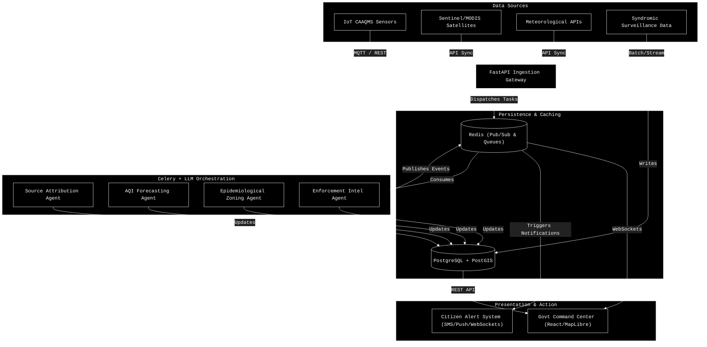

# AeroIntel: High-Level Design (HLD)

This document provides the high-level architecture and system flow for **AeroIntel**, demonstrating a robust, cloud-native approach that fuses IoT data, satellite imagery, and a Multi-Agent AI core to drive actionable Smart City interventions.

## 1. System Architecture Diagram

This architecture is built for extreme scalability and real-time responsiveness, leveraging FastAPI for ingestion, Redis for pub/sub alerting, and Celery for asynchronous AI orchestration.

## 2. Core Components

### 2.1 Data Ingestion Gateway (FastAPI)
The entry point for all geospatial and environmental data. It handles massive throughput from IoT sensors and external APIs, dumping raw data into the persistence layer and instantly queuing AI evaluation tasks in Redis.

### 2.2 Persistence & Caching (PostgreSQL/PostGIS + Redis)
- **PostgreSQL + PostGIS**: Handles all relational data and advanced geospatial queries (e.g., finding all vulnerable hospitals within a 2km radius of a predicted pollution spike).
- **Redis**: Serves a dual purpose: acting as the message broker for Celery AI tasks and the Pub/Sub engine powering live WebSockets on the frontend.

### 2.3 Multi-Agent AI Core (Celery Workers)
A cluster of background workers executing specialized AI tasks:
- **Attribution & Enforcement**: Correlates real-time spikes with geospatial landmarks (factories, construction sites).
- **Zoning & Forecasting**: Processes meteorological data to predict AQI dispersion and subsequent viral fever risks.

### 2.4 Presentation Layer
- **Command Center**: A React/Vite SPA utilizing MapLibre for fluid, interactive geospatial tracking tailored for City Administrators.
- **Citizen Alerts**: An automated system translating AI insights into regional-language advisories via localized LLMs.
