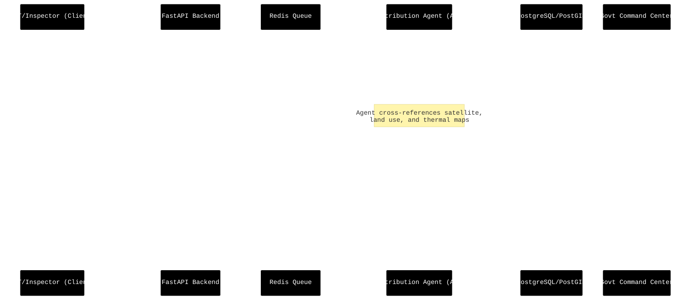
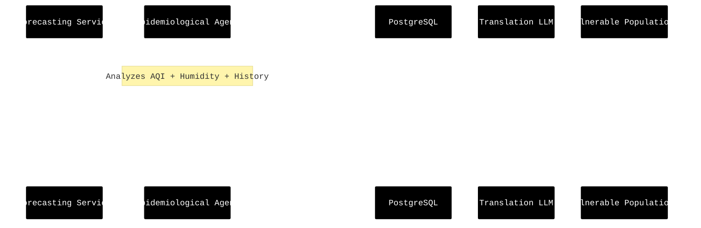
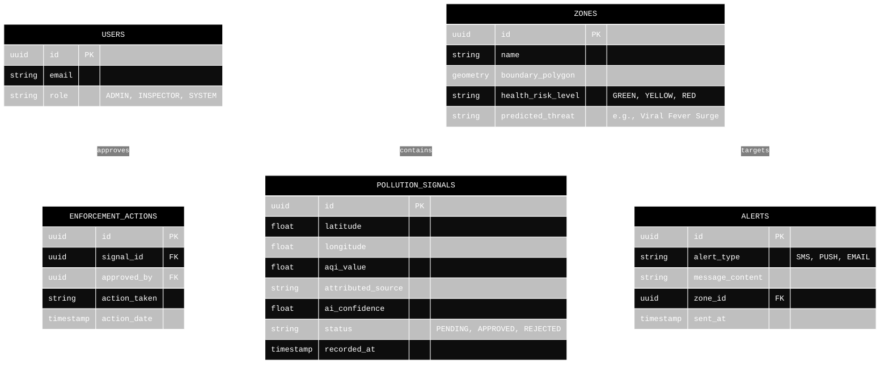

# AeroIntel: Low-Level Design (LLD)

This document details the micro-interactions, data models, and agent workflows that power the AeroIntel platform.

## 1. Enforcement & Approval Pipeline (Sequence Diagram)

This diagram illustrates how a raw pollution signal (or manual inspector report) moves through the AI attribution phase, into the administrative holding pattern, and finally to enforcement.

## 2. Citizen Health Risk Advisory Flow (Sequence Diagram)

This flow shows how the Epidemiological Zoning Agent predicts a viral fever outbreak based on AQI and triggers localized citizen alerts.

## 3. Core Entity-Relationship Diagram (Database Schema)

The database schema is heavily optimized for geospatial queries (via PostGIS extensions) and rapid real-time status updates.

## 4. API Specification Highlights

### `POST /api/v1/signals/ingest`
- **Purpose**: High-throughput endpoint for IoT sensors and ground inspectors to log pollution spikes.
- **Handling**: Validates payload via Pydantic, inserts to DB asynchronously, and pushes an event to Redis.

### `GET /api/v1/zones/vulnerability`
- **Purpose**: Fetches the current geospatial multipolygons representing health risk zones for rendering on MapLibre.
- **Returns**: GeoJSON FeatureCollection with embedded metadata (risk_level, predicted_threat).

### `POST /api/v1/admin/enforce/{signal_id}`
- **Purpose**: The approval gateway. Changes a pollution signal's status from PENDING to APPROVED, officially initiating government intervention protocols.
