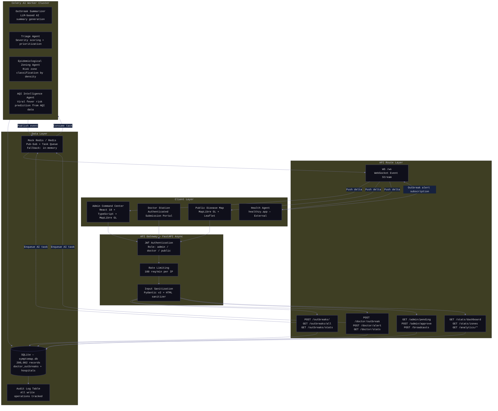
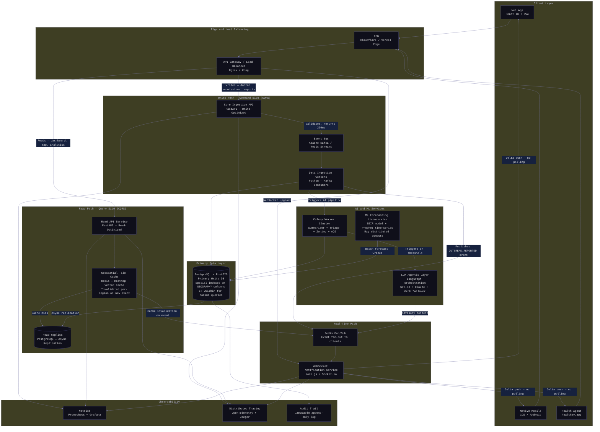
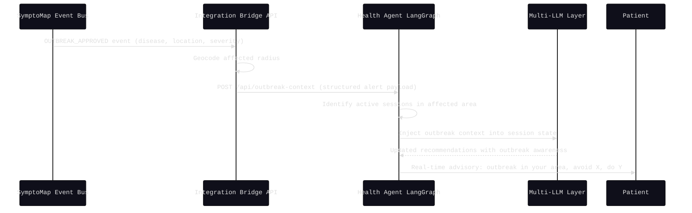

# System Architecture
## SymptoMap Healthcare Intelligence Platform — V1 Reality and V2 Target Design

This document provides a rigorous technical analysis of the current V1 architecture, identifies its structural bottlenecks at scale, and defines the target V2 enterprise architecture that resolves each bottleneck with established distributed systems patterns.

---

## 1. V1 Architecture: Implemented Reality

SymptoMap V1 is a functional proof-of-concept demonstrating the full surveillance workflow. The current deployment runs a React 18 frontend against a FastAPI async backend backed by SQLite, with 200,000+ seeded disease records across Indian hospitals and real-time communication via WebSockets with a Mock Redis pub/sub layer when a production Redis instance is unavailable.

### 1.1 V1 Architecture Diagram

### 1.2 V1 Bottlenecks at Scale

| Bottleneck | V1 Reality | Impact at Scale |
|:---|:---|:---|
| Polling anti-pattern | Frontend polls `/outbreaks/all` every 30 seconds | 10,000 active users = 20,000 requests/minute fetching unchanged JSON |
| SQLite write locks | Single-file DB locks on every write | 500 concurrent doctor submissions cause lock contention and request timeouts |
| Monolithic read/write path | Dashboard reads and outbreak writes share the same Uvicorn worker pool | Dashboard traffic starves the write path; critical outbreak data is delayed |
| No predictive intelligence | System is a CRUD map — it shows what happened, not what will happen | Zero outbreak forecasting; no anomaly detection; reactive not proactive |
| Mock Redis | In-memory Redis replacement resets on restart | No message durability; tasks lost on process restart in local dev |

---

## 2. V2 Target Architecture: Enterprise Design

V2 adopts an event-driven, microservices architecture with Command Query Responsibility Segregation (CQRS), resolving each V1 bottleneck with a proven distributed systems pattern.

### 2.1 V2 Architecture Diagram

### 2.2 Core Design Patterns Applied

**CQRS — Command Query Responsibility Segregation**
The write path (doctor submissions, outbreak reports) is completely separated from the read path (dashboard queries, map data). The Core Ingestion API validates and acknowledges a submission in under 20ms by publishing to the event bus — it never waits for the database write to complete. Background workers drain the event queue and persist data. Dashboards read from a read-optimized replica, never touching the primary write database.

**Event-Driven Architecture with Kafka**
Every outbreak submission produces an immutable event to the Kafka topic. This gives: (a) zero data loss during traffic spikes — the queue absorbs all writes while workers process at their own rate; (b) full replay capability — if an AI agent is upgraded, it can reprocess all historical events; (c) decoupled consumers — adding a new downstream service (e.g., a new notification channel) requires no changes to the ingestion API.

**PostGIS for Geospatial Query Performance**
SQLite is replaced by PostgreSQL with the PostGIS extension. All location data is stored as native `GEOGRAPHY(POINT, 4326)` columns with GiST (R-Tree) spatial indexes. A query like "find all outbreaks within 50km of a given coordinate" executes as a single indexed spatial query (`ST_DWithin`) in milliseconds on millions of rows — versus pulling all records into Python memory in V1.

**Multi-Tier Redis Caching for Geospatial Tiles**
Heatmap vector calculations are expensive. In V2, the computed GeoJSON tile for each viewport region is cached in Redis with a region-keyed TTL. Ten thousand simultaneous dashboard users hitting the same national map view result in exactly one database query. Cache entries are selectively invalidated only when a new outbreak event lands in that specific geographic region, via the Pub/Sub event stream.

**WebSocket Push Replacing Polling**
Clients connect once via WebSocket. When the event bus processes a new outbreak, it publishes a delta event to Redis Pub/Sub. The WebSocket Notification Service fans this out to all connected clients. Clients apply the delta to their local state in-place. No polling. No redundant full-payload fetches.

**ML Microservice Decoupling**
Forecasting models (SEIR epidemiological simulation, Prophet time-series) are CPU-bound and take seconds to minutes to run. In V2 they run in a dedicated ML microservice cluster managed by Ray for distributed compute. The ML service periodically writes forecast records to a dedicated `predictions` table. If the ML cluster fails, the surveillance dashboard degrades gracefully — it hides the forecast tab and shows historical data. Core outbreak reporting is entirely unaffected.

### 2.3 Tech Stack: V1 to V2 Upgrade Path

| Component | V1 Current | V2 Target | Justification |
|:---|:---|:---|:---|
| Database | SQLite (file lock on write) | PostgreSQL + PostGIS | Concurrent writes, spatial indexing, replication |
| Real-time | HTTP polling every 30 seconds | WebSockets + Redis Pub/Sub | Zero-latency deltas, no redundant bandwidth |
| Message Queue | Celery + Mock Redis | Apache Kafka / Redis Streams | Durable event log, zero data loss on restart |
| Caching | None | Redis multi-tier (tile + query) | Sub-millisecond dashboard reads at scale |
| AI/ML | Synchronous Celery tasks | Ray distributed ML microservice | CPU-bound forecasting isolated from API latency |
| LLM Orchestration | Direct calls in worker threads | LangGraph stateful agent framework | Stateful multi-turn reasoning, prompt versioning |
| Auth | JWT shared password | OAuth 2.0 + RBAC with per-doctor tokens | Enterprise security, individual accountability |
| Observability | Print statements | Prometheus + Grafana + OpenTelemetry | Production alerting and distributed tracing |
| Deployment | Single Uvicorn process | Kubernetes with HPA auto-scaling | Horizontal scale on demand, zero-downtime deploys |

### 2.4 Failure Mode Analysis

| Failure | V1 Behavior | V2 Behavior |
|:---|:---|:---|
| Database becomes unavailable | All API endpoints return 500; submissions are lost | Write API continues accepting submissions into Kafka queue; data is persisted once DB recovers (eventual consistency) |
| ML service crashes | None (no ML service) | Dashboard hides forecast tab; real-time surveillance continues unaffected |
| Redis unavailable | Falls back to Mock Redis (in-memory, resets on restart) | WebSocket push degrades to client-side polling fallback; no data loss |
| Traffic spike (10x normal load) | Uvicorn workers exhaust; requests queue or timeout | Kubernetes HPA scales API pods based on CPU and Kafka queue depth; event bus absorbs write burst |
| Single AI worker crashes | Task is lost | Kafka consumer group rebalances; another worker picks up the task from the committed offset |

---

## 3. Health Agent Architecture Integration

The Health Agent at [healthzy.app](https://healthzy.app/) connects to SymptoMap as an event consumer via the WebSocket bridge. In V2, this becomes a dedicated integration point:

This integration ensures that when a doctor reports a severe outbreak in Mumbai via SymptoMap, every active Health Agent consultation session for a user in the affected radius receives contextual outbreak awareness injected into their ongoing diagnostic session — without the user needing to do anything.
