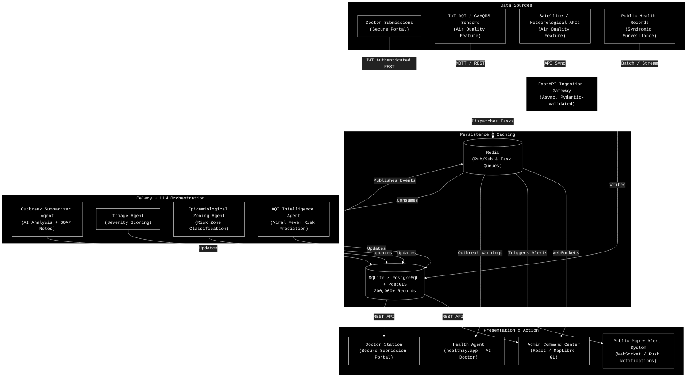

# SymptoMap: High-Level Design (HLD)

This document provides the high-level architecture and system flow for **SymptoMap** — a cloud-native, real-time disease surveillance platform that fuses doctor-reported data, AI analytics, and geospatial intelligence to enable rapid public health response. The system also integrates urban air quality monitoring features for epidemiological risk prediction.

## 1. System Architecture Diagram

This architecture is built for extreme scalability and real-time responsiveness, leveraging FastAPI for ingestion, Redis for pub/sub alerting, and Celery for asynchronous AI orchestration.

## 2. Core Components

### 2.1 Data Ingestion Gateway (FastAPI)
The entry point for all outbreak reports, sensor data, and external API feeds. Handles high-throughput input from doctors, IoT AQI sensors, and meteorological APIs. Validates all payloads via Pydantic, writes to the persistence layer, and instantly queues AI evaluation tasks in Redis. Input sanitization and rate limiting are enforced at this layer.

### 2.2 Persistence & Caching (SQLite/PostgreSQL + Redis)
- **SQLite / PostgreSQL + PostGIS**: Handles all relational data and geospatial queries (e.g., finding all vulnerable zones within a 5km radius of a reported outbreak). Over 200,000 disease records seeded across Indian hospitals.
- **Redis**: Serves dual purpose — message broker for Celery AI task queues and the Pub/Sub engine powering live WebSocket updates on the frontend.

### 2.3 Multi-Agent AI Core (Celery Workers)
A cluster of specialized background AI workers:
- **Outbreak Summarizer Agent**: Generates AI summaries and clinical SOAP notes for each report.
- **Triage Agent**: Auto-scores severity based on patient count, disease type, and location density.
- **Epidemiological Zoning Agent**: Classifies geographic areas into Mild / Moderate / Severe risk zones based on density vectors.
- **AQI Intelligence Agent**: Correlates air quality data with viral fever outbreak patterns and predicts risk zones. *(Air Quality Feature)*

### 2.4 Presentation Layer
- **Admin Command Center**: A React/Vite SPA using MapLibre GL for interactive outbreak visualization, approval workflows, and broadcast management.
- **Doctor Station**: A secure, authenticated portal where doctors submit outbreaks in under 30 seconds.
- **Public Map**: Real-time disease tracker accessible to the public without authentication.
- **Health Agent Integration**: The AI health consultation agent at [healthzy.app](https://healthzy.app/) receives real-time outbreak alerts via the WebSocket bridge, enabling proactive warnings to users in affected areas.

## 3. Key Design Decisions

| Decision | Rationale |
|---|---|
| SQLite for development | Zero-config local setup; 200K+ records work fine; PostgreSQL-ready for production |
| `deferred()` on Geography columns | Prevents SQLite `AsEWKB` errors while preserving PostGIS compatibility for production |
| Mock Redis in development | Eliminates Redis dependency for local dev; real Redis Pub/Sub used in production |
| Celery task isolation | All AI tasks wrapped in try/except to prevent crashes when broker is unavailable |
| JWT with 24-hour expiry | Balances security and usability for medical professionals |

## 4. Air Quality Intelligence (Extended Feature)

SymptoMap includes an optional air quality monitoring layer that fuses IoT CAAQMS sensor data, satellite imagery (Sentinel/MODIS), and meteorological APIs to:

- Track real-time AQI across urban zones
- Predict viral fever outbreak risk based on AQI + humidity + historical disease data
- Generate epidemiological risk zone boundaries (Green / Yellow / Red)
- Dispatch localized citizen advisories in regional languages

This feature demonstrates the platform's extensibility beyond infectious disease surveillance into urban environmental health monitoring.
