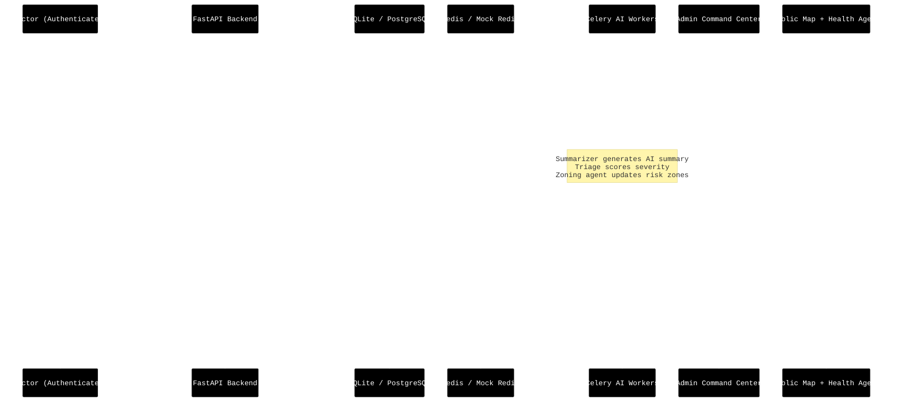
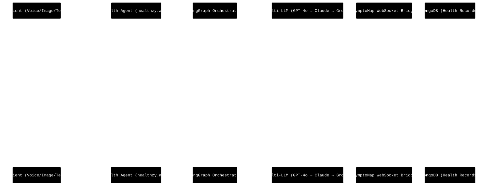
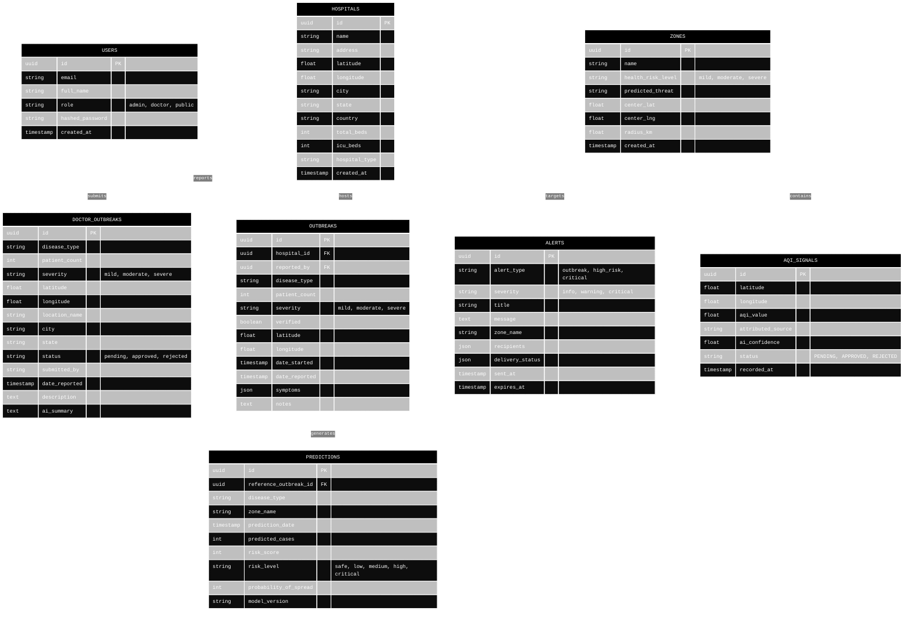

# SymptoMap: Low-Level Design (LLD)

This document details the micro-interactions, data models, agent workflows, and API contracts that power the SymptoMap platform.

## 1. Doctor Outbreak Submission & Approval Pipeline

This diagram illustrates how a doctor's outbreak report moves through the AI triage phase, into the admin approval workflow, and finally to verified status and real-time broadcast.



## 2. Health Agent Consultation Flow (Sequence Diagram)

This flow shows how the AI Health Agent receives an outbreak warning from SymptoMap and integrates it into a user consultation.



## 3. Core Entity-Relationship Diagram (Database Schema)

The database schema supports both the SYMPTOMAP disease surveillance data and the extended air quality intelligence feature.



## 4. API Specification Highlights

### `POST /api/v1/doctor/outbreak`
- **Auth**: JWT Bearer token (Doctor or Admin role)
- **Purpose**: High-speed outbreak submission from doctor portal
- **Handling**: Validates via Pydantic, inserts to `doctor_outbreaks`, triggers Celery AI tasks
- **Response**: `{ id, hospital_name, disease_type, patient_count, severity, message }`

### `GET /api/v1/outbreaks/all`
- **Auth**: Public
- **Purpose**: Aggregate outbreak data for the public map and admin dashboard
- **Returns**: Combined records from `doctor_outbreaks` + ORM `outbreaks` table, last 30 days by default
- **Params**: `days`, `severity`, `disease_type`, `limit`

### `GET /api/v1/outbreaks/stats`
- **Auth**: Public
- **Purpose**: Dashboard summary — total reports, pending review, high priority, active cases
- **Returns**: `{ total_reports, pending_review, high_priority, active_cases }` — combining both tables

### `POST /api/v1/admin/approve/{id}`
- **Auth**: Admin JWT only
- **Purpose**: Approval gateway — changes status from `pending` to `approved`, triggers broadcast
- **Effect**: Updates `doctor_outbreaks.status`, publishes `OUTBREAK_APPROVED` WebSocket event

### `GET /api/v1/stats/dashboard`
- **Auth**: Admin JWT
- **Purpose**: Full dashboard statistics including zone counts, weekly comparisons, disease distribution

### `POST /api/v1/broadcasts`
- **Auth**: Admin JWT
- **Purpose**: Create and send a public health advisory broadcast
- **Body**: `{ title, message, severity, target_regions, expires_at }`

### `WS /api/v1/ws`
- **Auth**: None (public WebSocket)
- **Purpose**: Real-time event stream for map updates, new outbreaks, broadcasts, and alerts

## 5. Security Architecture

```
Authentication:  JWT tokens · bcrypt hashing · 24-hour auto-expiry
Authorization:   Role-based (admin / doctor / public) · Endpoint-level guards
Input Safety:    Pydantic v2 validation · HTML sanitization · SQL parameterization
Network:         CORS enforcement · Rate limiting (100 req/min) · HTTPS-only in production
Audit:           All write operations logged to audit_log table with actor, IP, timestamp
Data:            User passwords never stored in plain text · Sensitive fields encrypted at rest
```
